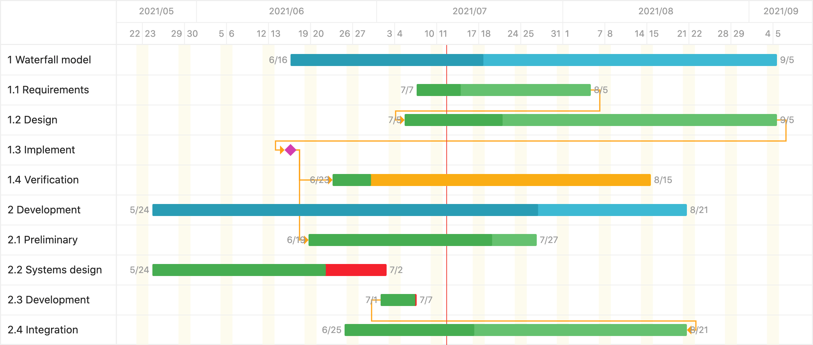

Gantt Chart
===========

> Gantt chart library using jsx support SVG, Canvas and SSR

[](https://www.npmjs.com/package/gantt)
[](https://www.npmjs.com/package/gantt)
[](https://greenkeeper.io/)

## Install

```bash
$ npm install gantt --save
```

## Usage

[View demo online](https://d-band.github.io/gantt/)

```javascript
import { SVGGantt, CanvasGantt, StrGantt } from 'gantt';

const data = [{
  id: 1,
  type: 'group',
  text: '1 Waterfall model',
  start: new Date('2018-10-10T09:24:24.319Z'),
  end: new Date('2018-12-12T09:32:51.245Z'),
  percent: 0.71,
  links: []
}, {
  id: 11,
  parent: 1,
  text: '1.1 Requirements',
  start: new Date('2018-10-21T09:24:24.319Z'),
  end: new Date('2018-11-22T01:01:08.938Z'),
  percent: 0.29,
  links: [{
    target: 12,
    type: 'FS'
  }]
}, {
  id: 12,
  parent: 1,
  text: '1.2 Design',
  start: new Date('2018-11-05T09:24:24.319Z'),
  end: new Date('2018-12-12T09:32:51.245Z'),
  percent: 0.78,
}];

new SVGGantt('#svg-root', data, {
  viewMode: 'week'
});

new CanvasGantt('#canvas-root', data, {
  viewMode: 'week'
});

const strGantt = new StrGantt(data, {
  viewMode: 'week'
});
this.body = strGantt.render();
```



## API

```typescript
interface Link {
  target: number,
  type: 'FS' | 'FF' | 'SS' | 'SF'
}

interface Item {
  id: number,
  parent: number,
  text: string,
  start: Date,
  end: Date,
  percent: number,
  links: Array<Link>
}

type StyleOptions = {
  bgColor: string,           // default: '#fff'
  lineColor: string,         // default: '#eee'
  redLineColor: string,      // default: '#f04134'
  groupBack: string,         // default: '#3db9d3'
  groupFront: string,        // default: '#299cb4'
  taskBack: string,          // default: '#65c16f'
  taskFront: string,         // default: '#46ad51'
  milestone: string,         // default: '#d33daf'
  warning: string,           // default: '#faad14'
  danger: string,            // default: '#f5222d'
  link: string,              // default: '#ffa011'
  textColor: string,         // default: '#222'
  lightTextColor: string,    // default: '#999'
  lineWidth: string,         // default: '1px'
  thickLineWidth: string,    // default: '1.4px'
  fontSize: string,          // default: '14px'
  smallFontSize: string,     // default: '12px'
  fontFamily: string,        // default: '-apple-system, BlinkMacSystemFont, "Segoe UI", Roboto, "Helvetica Neue", Arial, sans-serif'
}

type Options = {
  viewMode: 'day' | 'week' | 'month',
  onClick: (item: Item) => {},
  offsetY: number,               // default: 60,
  rowHeight: number,             // default: 40,
  barHeight: number,             // default: 16,
  thickWidth: number,            // default: 1.4,
  styleOptions: StyleOptions
}

declare class SVGGantt {
  constructor(element: string | HTMLElement, data: Array<Item>, options: Options);
  setData(data: Array<Item>): void;      // set data and re-render
  setOptions(options: Options): void;    // set options and re-render
  render(): void;
}

declare class CanvasGantt {
  constructor(element: string | HTMLElement, data: Array<Item>, options: Options);
  setData(data: Array<Item>): void;      // set data and re-render
  setOptions(options: Options): void;    // set options and re-render
  render(): void;
}

declare class StrGantt {
  constructor(data: Array<Item>, options: Options);
  setData(data: Array<Item>): void;
  setOptions(options: Options): void;
  render(): string;
}
```

## Report a issue

* [All issues](https://github.com/d-band/gantt/issues)
* [New issue](https://github.com/d-band/gantt/issues/new)

## License

Gantt is available under the terms of the MIT License.
